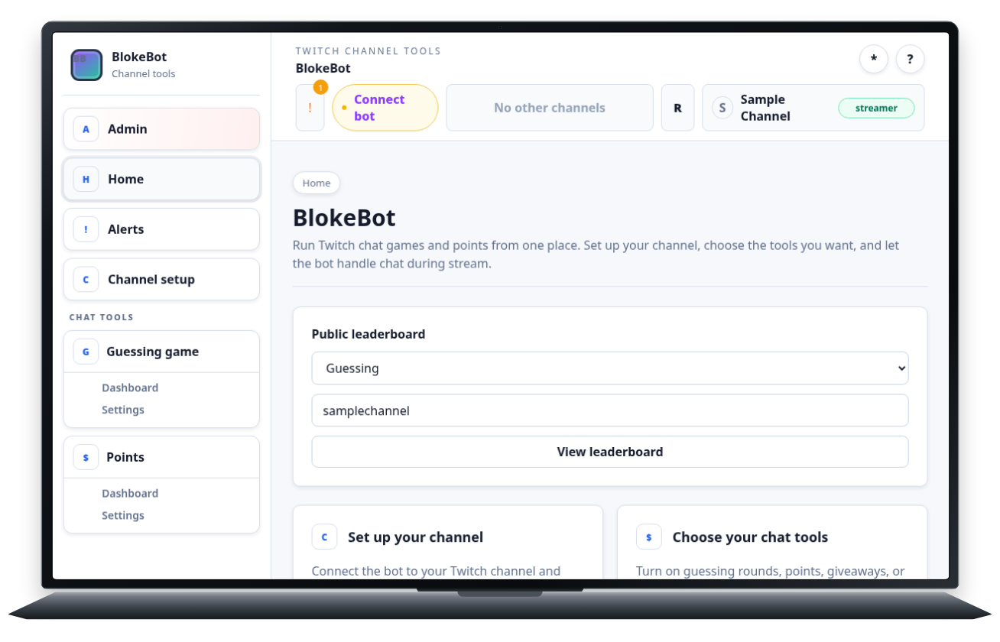
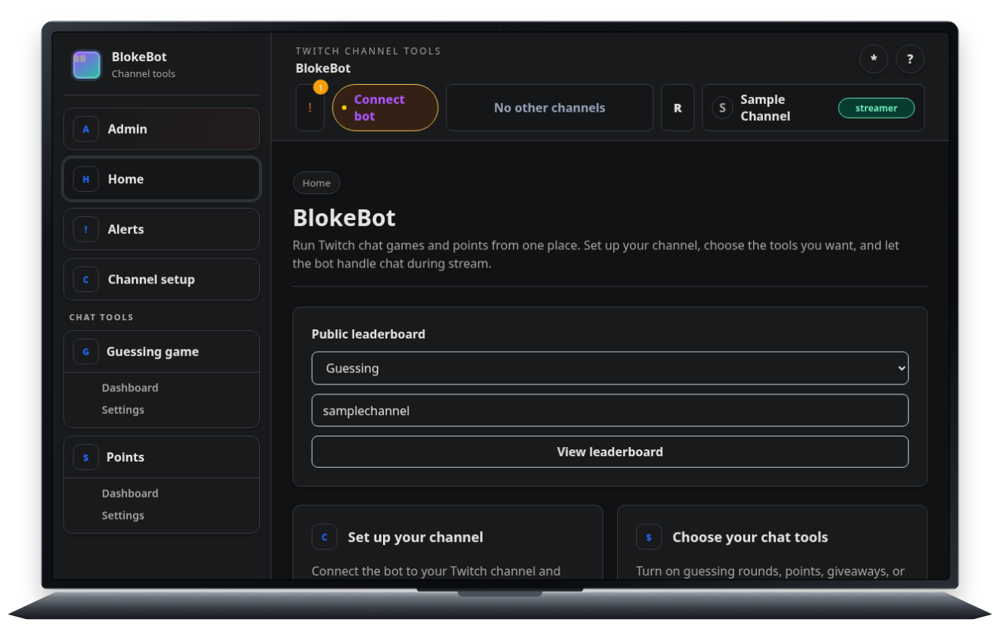
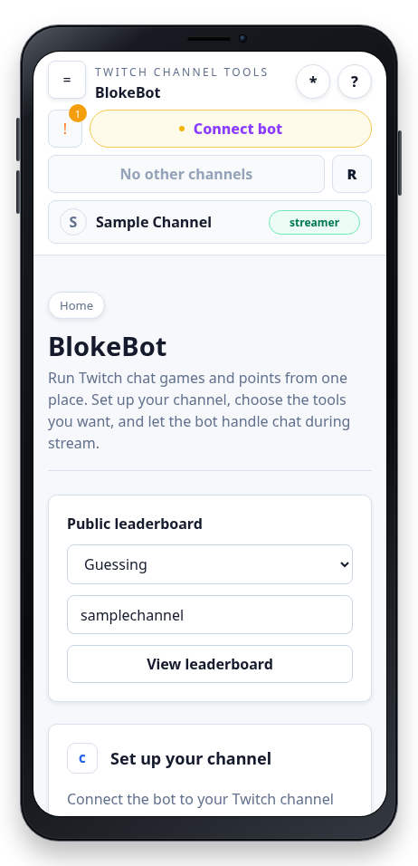
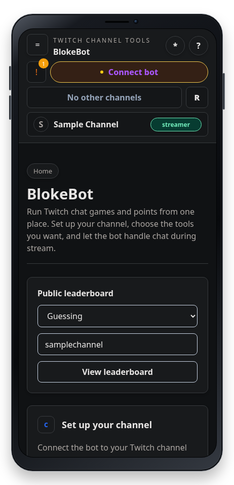

# Medium Viset example

This project captures a BlokeBot-style channel-tools screen across laptop/phone and light/dark axes. `screenshots.lua` produces four PNGs, while `home-scroll.lua` produces four continuous WebP recordings. Each file contains its own TOML header and imperative Lua capture.

The home-scroll recording follows BlokeBot's original simulation rhythm: an opening hold, one sine-eased downward gesture, an intermediate hold, a second downward gesture, and a final hold. Phone recordings show the 42 px touch-contact circle during both gestures.

The screenshots use `frame = "builtin:auto"`, which selects Viset's built-in laptop or phone frame from the chosen device. The available selectors are `builtin:auto`, `builtin:phone`, and `builtin:laptop`.

From the Viset repository root, generate all outputs:

```sh
viset capture examples/medium/screenshots.lua --force
viset capture examples/medium/home-scroll.lua --force
```

Open all four PNGs and four WebPs:

```sh
for file in \
  examples/medium/output/screenshots/laptop-light.png \
  examples/medium/output/screenshots/laptop-dark.png \
  examples/medium/output/screenshots/phone-light.png \
  examples/medium/output/screenshots/phone-dark.png \
  examples/medium/output/animations/laptop-light-home-scroll.webp \
  examples/medium/output/animations/laptop-dark-home-scroll.webp \
  examples/medium/output/animations/phone-light-home-scroll.webp \
  examples/medium/output/animations/phone-dark-home-scroll.webp
do
  xdg-open "$file"
done
```

Generated captures:






- [Laptop light home-scroll recording](output/animations/laptop-light-home-scroll.webp)
- [Laptop dark home-scroll recording](output/animations/laptop-dark-home-scroll.webp)
- [Phone light home-scroll recording](output/animations/phone-light-home-scroll.webp)
- [Phone dark home-scroll recording](output/animations/phone-dark-home-scroll.webp)

Capture files are trusted local Lua code and run with Lua's standard libraries.
