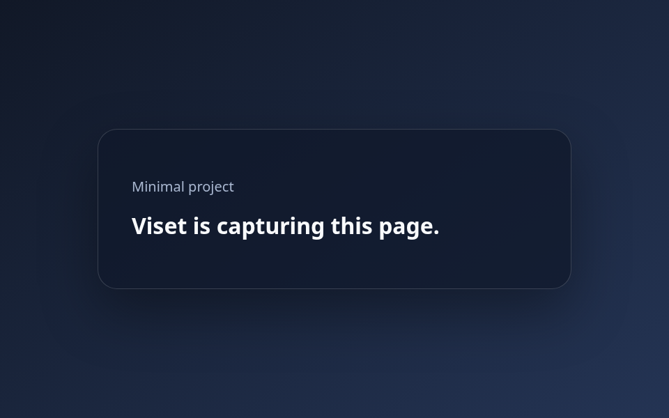

# Minimal Viset example

This project serves one editable HTML page and captures one desktop PNG. The TOML header and capture logic both live in `capture.lua`.

From the Viset repository root, generate the output:

```sh
viset capture examples/minimal/capture.lua --force
```

Open the generated file:

```sh
xdg-open examples/minimal/output/screenshots/home.png
```



Capture files are trusted local Lua code and run with Lua's standard libraries.
